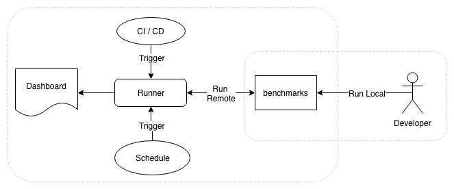

 # js-ipfs Benchmarks [](https://circleci.com/gh/ipfs/benchmarks)

This is a set of benchmarks tests to track [js-ipfs](https://github.com/ipfs/js-ipfs) Benchmarks in a Grafana [Dashboard](https://benchmarks.ipfs.team).

## Purpose

The IPFS team needs a historical view of various performance metrics around `js-ipfs`
and how it compares to the reference implementation written in `go`. This project
implements benchmark tests for `js-ipfs` and publishes the results in a dashboard.
The artifacts are also made available on the IPFS network. Over time the historical
view will expose how `js-ipfs` is hopefully approaching the `go` implementation
and which areas need improvement.



The goal is to provide immediate feedback and long-term tracking around performance
to developers and the community with an extremely low barrier.
The CI system integrating code changes will trigger benchmark runs as well a scheduled
run every night. Each run will provide a URL where the results will be visible.

This project also provides a possibility to run tests locally on a development
version of `js-ipfs`. Developers can then examine individual output files before
submitting code to the community.

## Documentation Index

* The [dashboard](infrastructure/grafana/README.md) documentation
* [Architecture](infrastructure/README.md) of the `js-ipfs` benchmark system
* Reference on how this [Repository](CONTRIBUTING.md) is organized
* Using the [Runner](runner/README.md) to manage benchmark runs remotely, which includes an [API](https://benchmarks.ipfs.team/runner/docs/index.html) available [here](https://benchmarks.ipfs.team/runner)
* Description of [tests](tests/README.md)
* Convenience [scripts](scripts/README.md) for the docker-compose [deployment](infrastructure/deploy/README.md)
* Overview [video](https://ipfs.io/ipfs/QmSZgcL7dyjcifZ5uJYmBDCCACfzQD5Ve2RFSoB4RdYATp) hosted on the IPFS network.
* [Introduction to Clinic.js in the context of IPFS](https://github.com/ipfs/team-mgmt/issues/796) [Recording](https://nearform.zoom.us/recording/play/A-4Vn3jA5aeK9BCPwKCA44IfwpLZePIBlzvD1bUYF7JqTXnG2JptVaLEVcRUmQ1i)

## Benchmarks on the web

The dashboard is available at [https://benchmarks.ipfs.team](https://benchmarks.ipfs.team) and can be viewed without a user account.
A `Continuous Integration` server can trigger benchmark runs using the endpoint exposed on [https://benchmarks.ipfs.team/runner](https://benchmarks.ipfs.team/runner). A commit from the [js-ipfs](https://github.com/ipfs/js-ipfs) repository can be supplied to run the benchmarks against. An api key is also required to be able to trigger a run. Please check [Runner](runner/README.md) docs on how to configure an api key for the runner. An example invocation using curl is provided below.

```bash
> curl -XPOST -d '{"commit":"adfy3hk"}' \
  -H "Content-Type: application/json" \
  -H "x-ipfs-benchmarks-api-key: <api-key>" \
  https://benchmarks.ipfs.team/runner
```

The response provides links to the output produced by the benchmark tests:

```
TBD
```

For more details about the dashboard see the [Grafana](infrastructure/grafana/README.md) doc.

## Quickstart

Clone Benchmark tests and install:

```bash
>  git clone https://github.com/ipfs/benchmarks.git
>  cd benchmarks/runner
>  npm install
>  cd ../tests
>  npm install
```

### Generate test files

The files are defined in [fixtures](tests/lib/fixtures.js).

```bash
> npm run generateFiles
```

### Add test files

Here is the file object for a single test:

```js
{ size: KB, name: 'OneKBFile' }
```

To add multiple test files add a count property:

```js
{ size: KB, name: 'OneHundredKBFile', count: 100 }
```

### Run tests locally

From the `benchmarks/tests` directory:

```bash
> node local-add
> node local-extract
> node local-transfer
```

Run all benchmarks:

```bash
> npm run benchmark
```

Create a pre-generated key:

```bash
> node lib/create-privateKey
```

#### FILESET

Use env variable `FILESET` to run test just against that specific set of file(s).  Options of `FILESET` are defined in the config.

```bash
> FILESET="One64MBFile" node local-add
```

#### VERIFYOFF

Use env variable `VERIFYOFF=true` to skip the pre-generation of test files.

```js
> VERIFYOFF=true node local-add
```

#### Run tests locally on a js-ipfs branch

Inside the `benchmarks/tests` dir is a script to pull down master branch and install:

```bash
> ./getJsIpfs.sh ../
```

Directory structure now :
```
├── benchmarks
├──── js-ipfs
├──── tests
```

Run tests against branch

```bash
> cd benchmarks/tests
> STAGE=local REMOTE=true node local-add
```

#### FLAGS

Below is a list of optional flags used by the tests to run a specific strategy or transport module in Libp2p.

- `-s` DAG strategy (balanced | trickle)
- `-t` Transport (tcp | ws)
- `-m` Stream muxer (mplex, spdy)
- `-e` Connection encryption (secio)

### Adding new tests

See [README](tests/README.md).

###  Results

Results will be written to out directory under `benchmarks/tests`

* `name`: Name of test
* `warmup`: Flag for if we warm up db
* `description`: Description of benchmark
* `fileSet`: Set of files to be used in a test
* `date`: Date of benchmark
* `file`: Name of file used in benchmark
* `meta.project`: Repo that are benchmarked
* `meta.commit`: Commit used to trigger benchmark
* `meta.version`: Version of js-ipfs
* `duration.s`: The number of seconds for benchmark
* `duration.ms`: The number of millisecs the benchmark took
* `cpu`: Information about cpu benchmark was run on
* `loadAvg`: The load average of machine

## License

Copyright (c) Protocol Labs, Inc. under the MIT license. See [LICENSE file](./LICENSE) for details.
