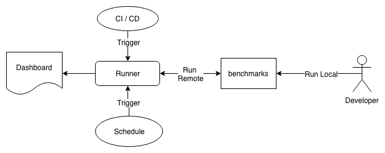

# IPFS Benchmarks

This A set of benchmark tests to track IPFS performance.

## Purpose
The IPFS team needs a historical view of various performance metrics around `js-ipfs` and how it compares to the reference implementation written in `go`. This project implements benchmark tests for `js-ipfs` and publishes the results in a dashboard. The artifacts are also made available on the IPFS network. Over time the historical view will expose how `js-ipfs` is hopefully approaching the `go` implementation and which areas need improvement.



The goal is to provide feedback around performance to developers and the community with an extremely low barrier. The CI system integrating code changes will trigger benchmark runs. Each run will provide a URL to the CI system where the results will be visible.

This project also provides a possibility to run tests locally on a development version of `js-ipfs`. Developers can then examine individual output files before submitting code to the community.

## Links
* Reference on how this [Repository](docs/repo.md) is organized
* Using the [Runner](docs/runner.md) to manage benchmark runs remotely
* Description of [tests](docs/tests.md)

## Quickstart

Clone Benchmark tests and install:

```bash
>  git clone https://github.com/ipfs/benchmarks.git
>  cd benchmarks/tests
>  npm install
>  cd ../benchmarks/runner
>  npm install
```

### Run tests locally

From the benchmark/tests directory:
```bash
> node local-add
> node loca-extract
> node local-transfer
```

Run all benchamrks:
```bash
> npm run benchmark
```

### Run sub tests
TODO:

###  Results

Results will be written to out directory under /tests
