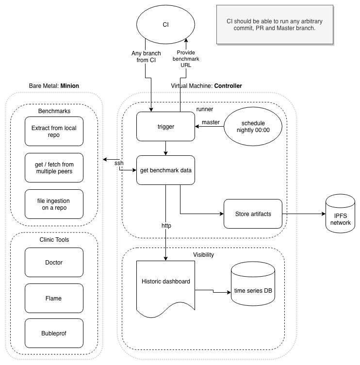

## Runner
The runner is the component that kicks off the tests and stores the results in a time series database for visualization.

### Initial Setup Grafana InfluxDB
```bash
> docker-compose -f infrastructure/local/docker-compose.yaml up
```
Open http://localhost:3000/ in a browser. The default username/password combination is `admin/admin`. You will be asked to change that password after initial login. Setup the datasource with type `influxDB`and use `http://influxdb:8086` as the URL. Next import the dashboard from `infrastructure/grafana/dashboard.json` by hovering over the `+` icon on the left of your screen.


* All of the Grafana configuration is stored in a folder adjacent to the this project's folder named `/data/grafana`.
* The data for influxDB is stored in a folder adjacent to the this project's folder named `/data/influxdb`.

### Run dashboard and the `runner` locally and send results to InfluxDB

If you're not running it yet:
```bash
> docker-compose -f infrastructure/local/docker-compose.yaml up
```

Keep docker running and in another tab run:
```bash
> STAGE=local LOG_PRETTY=true node runner/index.js
```

To view the Grafana dashboard: http://localhost:3000/

Use the default account admin/admin to login

### Production architecture

The diagram below describes the production setup.



Production is comprised of two hosts:
* The `controller`; a Virtual Machine with the `runner`, `datastore` and `dashboard`
* The `minion`; a Bare metal machine to run the benchmarks.

### controller
The controller runs the [runner](../runner/) as a daemon in a docker container and exposes an endpoint to be able to trigger a benchmark run with parameters.
Also the datastore, InfluxDB, and the dashboard, Grafana, are run inside containers, all using [docker-compose](https://docs.docker.com/compose/).

The runner can be triggered from a remote resource but will, at least, be triggered once a day on a schedule to ensure there is a data point for each day.

The runner is responsible for running the latest benchmark tests on the `minion`. [Ansible](https://www.ansible.com/) is used to manage the provisioning state of the `minion` before each run. The benchmarks write the test results in a file determined by a parameter. After the run, this file is retrieved and parsed by the runner. The results are then written to the datastore as well as stored on the IPFS network.

### minion
This `bare metal` machine will be kept as clean as possible to enable reliable results from the benchmarks. Tests are run over `ssh` from the `controller`. At the end of the test, any generated files and resources should be cleaned up.
Tests kept up to date before each run and are always run in sequence.