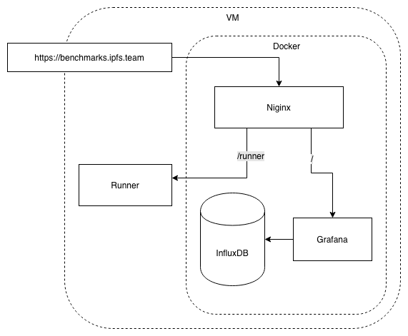

## Deploying the Controller IPFS benchmarks

The runner and it's supporting applications are deployed using [docker-compose](https://docs.docker.com/compose/reference/overview/#command-options-overview-and-help). To run a minimal local development setup you need the following  parts:
1. Nginx
2. InfluxDB
3. Grafana

To run the stack locally all you need is [docker-compose.yaml](docker-compose.yaml) file. The runner runs on the host, listening on port 9000, outside of Docker. The [Ansible](/infrastructure/playbooks/README.md) playbook takes care of creating a Docker network that is allowed to access port 9000 on the host.
For production, there is an nginx reverse proxy to route traffic to `Grafana` on `/` and expose the runner's endpoint on `/runner`.
In production we add the [docker-compose.prod.yaml](docker-compose.prod.yaml) to configure and run the production setup. Also SSL certificate provisioning is handled for production with [certbot](https://github.com/certbot/certbot)

4. nginx
5. certbot

Convenience scripts to run the different docker-compose setups are located under [/scripts](/scripts/README.md)

### Certbot initialization
Nginx is configured to use certificates and will fail if the certificate files are not present. On a new deployment, no certificates will be available so before the first run a dummy certificate should be installed with [sudo ./init_letsencrypt.sh](./init_letsencrypt.sh). This installs a self signed cert starts nginx and certbot will initiate a handshake with let's encrypt to retrieve the real certificate and replace the self signed cert with the real one.

Let's encrypt only works with publicly resolvable domains.