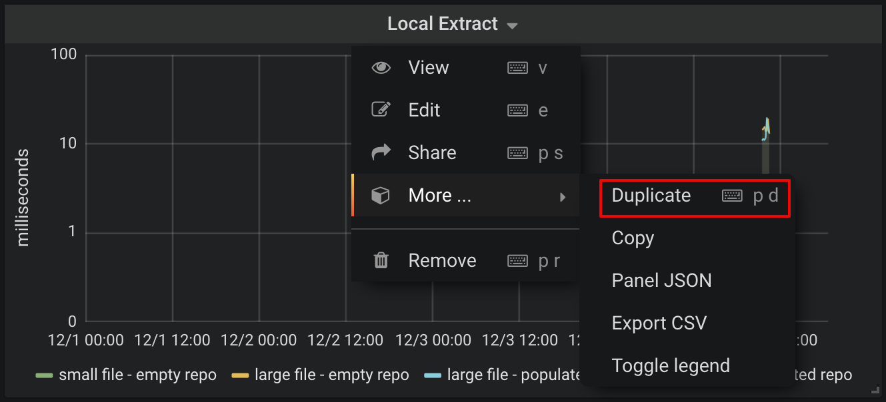
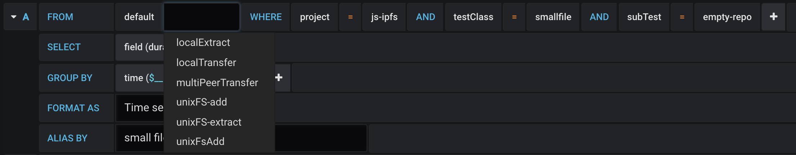

# Dashboard

In this directory the last dashboard json export is stored.

## Metrics
For each benchmark test carried out, there is a graph in the dashboard.
* local transfer
* local add
* local extract
* multi peer transfer

Each graph contains 4 lines, one for every test combination:
* empty repo / 10k file
* empty repo / 1m file
* populated repo / 10k file
* populated repo / 1m file

Each of these metrics is backed by an InfluxDB  query. Queries are constructed using grafana's built in query constructor which provides autocomplete and instant feedback. An example of one of those raw queries is:
```
"SELECT mean("duration") FROM "localTransfer" WHERE ("project" = 'js-ipfs' AND "testClass" = 'smallfile' AND "subTest" = 'empty-repo') AND time >= now() - 7d GROUP BY time(15m) fill(none);SELECT mean("duration") FROM "localTransfer" WHERE ("project" = 'js-ipfs' AND "testClass" = 'largefile' AND "subTest" = 'empty-repo') AND time >= now() - 7d GROUP BY time(15m) fill(none);SELECT mean("duration") FROM "localTransfer" WHERE ("project" = 'js-ipfs' AND "testClass" = 'largefile' AND "subTest" = 'populated-repo') AND time >= now() - 7d GROUP BY time(15m) fill(none);SELECT mean("duration") FROM "localTransfer" WHERE ("project" = 'js-ipfs' AND "testClass" = 'smallfile' AND "subTest" = 'populated-repo') AND time >= now() - 7d GROUP BY time(15m) fill(none)"
```
## Adding new metrics
The easiest way to add a new metric to the dashboard is by duplicating an existing graph and modifying the query.
You need to be logged in as `admin` to be able to do this.
Duplicating is done by clicking the title of a graph and selecting `duplicate`, as in the image below.

A new graph will appear in the next available space with the exact same contents.
Clicking the title and selecting `edit`will allow you to change the queries. Each line in the graph is backed by an InfluxDB query. Just click the second field after `FROM`, to change the measurement source for the metric in the graph. In the image below you can see an example of that.

Do this for all queries and save the graph with a meaningful comment.