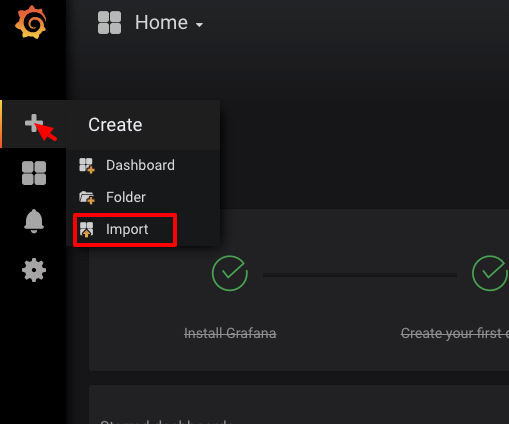

## Runner
The [runner](../runner/) is the component that kicks off the tests and stores the results in a time series database for visualization. The runner runs as a daemon but can also be run ad-hoc. See below for the differences


### Initial Setup Grafana InfluxDB
```bash
> ./scripts/runLocal.sh up
```
Open http://localhost:3000/ in a browser. The default username/password combination is `admin/admin`. You will be asked to change that password after initial login. Setup the datasource with type `influxDB`and use `http://influxdb:8086` as the URL. Next import the dashboard from `infrastructure/grafana/dashboard.json` by hovering over the `+` icon on the left of your screen.



* All of the Grafana configuration is stored in a folder adjacent to the this project's folder named `/data/grafana`.
* The data for influxDB is stored in a folder adjacent to the this project's folder named `/data/influxdb`.

### Run dashboard and the `runner` locally and send results to InfluxDB

If you're not running it yet:
```bash
> ./scripts/runLocal.sh up
```

Keep docker running and in another tab you can start the runner in one of two ways:
#### Start as a daemon
```bash
> STAGE=local LOG_PRETTY=true node runner/index.js
{"level":30,"time":1543488515841,"msg":"Server listening at http://127.0.0.1:9000","pid":47039,"hostname":"mbpro.local","v":1}
{"level":30,"time":1543488515843,"msg":"server listening on 9000","pid":47039,"hostname":"mbpro.local","v":1}
```
A run can now be triggered by sending a POST to the daemon:
```bash
> curl -XPOST -d '{"commit":"adfy3hk"}' \
  -H "Content-Type: application/json" \
  -H "x-ipfs-benchmarks-api-key: supersecret" \
  localhost:9000
```

#### Add-hoc run

```bash
> STAGE=local LOG_PRETTY=true node runner/cli.js
INFO [1543488677803] (47515 on mbpro.local): Running [OUT_FOLDER=/tmp/out REMOTE=true node /Users/elexy/projects/nearform/ipfs/benchmarks/tests/local-transfer.js] locally
INFO [1543488688568] (47515 on mbpro.local): Creating a node..
Swarm listening on /ip4/127.0.0.1/tcp/4014/ws/ipfs/QmYUDZWVCuahJfiVonM8GfftQ8rCDgMSvjM9zxpGANHEq2
Swarm listening on /ip4/127.0.0.1/tcp/4012/ipfs/QmYUDZWVCuahJfiVonM8GfftQ8rCDgMSvjM9zxpGANHEq2
Swarm listening on /ip4/127.94.0.1/tcp/4012/ipfs/QmYUDZWVCuahJfiVonM8GfftQ8rCDgMSvjM9zxpGANHEq2
...
    3: {
      "measurement": "unixFS-extract",
      "tags": {
        "subTest": "populated-repo",
        "commit": "TBD",
        "project": "js-ipfs",
        "testClass": "largefile"
      },
      "fields": {
        "duration": 19.077
      },
      "timestamp": "2018-11-29T10:51:41.010Z"
    }
```


To view the Grafana dashboard: http://localhost:3000/

Use the default account admin/admin to login